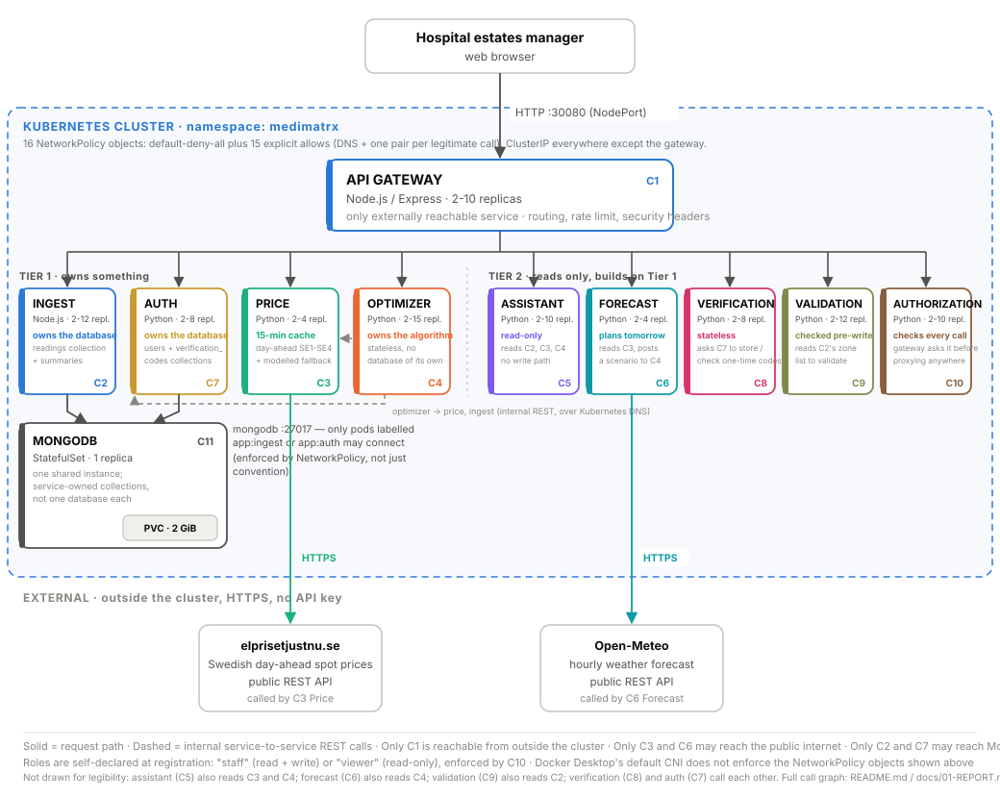

# MediMatrx: Hospital Energy Optimisation Platform

A microservice application that cuts a hospital's electricity bill by moving
deferrable work into cheap-electricity hours, **without ever touching clinical
load**.

Built for the Cloud Computing assignment at Blekinge Institute of Technology.
Uses **live Swedish electricity spot prices** from the public
[elprisetjustnu.se](https://www.elprisetjustnu.se) API and **live weather
forecasts** from [Open-Meteo](https://open-meteo.com). Neither needs an API key,
so the whole system runs with no credentials of any kind.

---

## What it does

Swedish electricity is priced hourly on a day-ahead market, and the cheapest hour
of the day typically costs about a third of the most expensive hour. Hospitals
run 24/7 and spend 8-15 MSEK a year on power, but only part of that load is
negotiable.

MediMatrx separates the two:

- **Clinical load**: ICU, operating theatres, imaging, wards. Never touched.
  This is enforced server-side, in the optimizer, where a user interface cannot
  bypass it.
- **Deferrable load**: laundry, sterilisation, catering, HVAC pre-cooling. The
  work still happens today; *when* it happens is a choice.

It then reports the money saved, the reduction in peak demand (a separate bill),
the carbon avoided, and any equipment behaving like it is about to fail.

On the demo dataset: **~12% off the energy bill plus a peak-demand reduction, in the order of 1.3-1.6 MSEK per year for a single hospital.**

---

## Architecture

```
Browser ──► C1 API Gateway (Node.js) ──┬──► C2 Ingest Service (Node.js) ──► C11 MongoDB
             NodePort :30080           │         owns the data              StatefulSet
             the only way in           │                                        + PVC
   ── Tier 1: owns something ──────────┤
                                        ├──► C3 Price Service (Python) ──► elprisetjustnu.se
                                        │         caches 15 min              (public API)
                                        │
                                        ├──► C4 Optimizer Service (Python)
                                        │         stateless brain
                                        │         calls ingest + price
                                        │
                                        ├──► C7 Auth Service (Python) ──► C11 MongoDB
                                        │         registration, login,        (users,
                                        │         issues JWTs                 verification_codes)
                                        │
   ── Tier 2: reads only ───────────────┤
                                        ├──► C5 Assistant Service (Python)
                                        │         natural language, read-only
                                        │         calls ingest + price + optimizer
                                        │
                                        ├──► C6 Forecast Service (Python) ──► Open-Meteo
                                        │         predicts tomorrow's load    (public API)
                                        │         from the weather, then asks
                                        │         the optimizer to plan it
                                        │
                                        ├──► C8 Verification Service (Python)
                                        │         one-time codes, stateless
                                        │         (delegates storage to auth)
                                        │
                                        ├──► C9 Validation Service (Python)
                                        │         checks a reading / a
                                        │         registration before it lands
                                        │
                                        └──► C10 Authorization Service (Python)
                                                  checks a JWT + role before
                                                  the gateway proxies anywhere
```



| # | Tier | Service | Language | Replicas | Owns state | Role |
|---|---|---|---|---|---|---|
| C1 | --- | **gateway** | Node.js / Express | 2-10 | no | Single public entry point; serves the dashboard; routing, rate limiting, security headers, auth enforcement |
| C2 | 1 | **ingest** | Node.js / Express | 2-12 | **MongoDB** (`readings`) | Receives and stores meter readings; serves 24-hour aggregates |
| C3 | 1 | **price** | Python / FastAPI | 2-4 | cache only | Fetches live spot prices; caches; degrades gracefully when upstream fails |
| C4 | 1 | **optimizer** | Python / FastAPI | 2-15 | no | Computes the load-shifting plan, savings and anomalies |
| C5 | 2 | **assistant** | Python / FastAPI | 2-10 | no | Answers questions in plain English, grounded strictly in the other services' APIs |
| C6 | 2 | **forecast** | Python / FastAPI | 2-4 | no | Predicts tomorrow's load from the weather forecast, then asks the optimizer to plan it |
| C7 | 1 | **auth** | Python / FastAPI | 2-8 | **MongoDB** (`users`, `verification_codes`) | Registers staff accounts, checks credentials, issues JWTs |
| C8 | 2 | **verification** | Python / FastAPI | 2-8 | no | Issues and checks one-time account codes; stores nothing itself, asks auth to |
| C9 | 2 | **validation** | Python / FastAPI | 2-12 | no | Checks a meter reading or a registration is well-formed before it reaches its owner |
| C10 | 2 | **authorization** | Python / FastAPI | 2-10 | no | Decodes a JWT and checks the caller's role against the action attempted |
| C11 | --- | **mongodb** | MongoDB 7.0 | 1 | **yes** | Persistent storage on a PersistentVolumeClaim, shared by ingest and auth |

**Patterns used:** API Gateway · Grounded Assistant (tool-use over own APIs) · Service-Owned Collections (shared MongoDB) · Backend for Frontend ·
Service Discovery · Cache-Aside · Graceful Degradation · Retry with Backoff ·
Health/Readiness Separation · Bulkhead & Fail-Fast · Stateless Compute ·
Externalised Configuration · Authentication/Authorization Separation · Least Privilege (NetworkPolicy).

Full design rationale, benefits, challenges and the security analysis are in
**[`docs/01-REPORT.md`](docs/01-REPORT.md)**.

---

## Quick start

**Prerequisites:** Docker Desktop with Kubernetes enabled, and a free Docker Hub
account.

```powershell
# 1. Build the ten images and push them to your Docker Hub account
powershell -ExecutionPolicy Bypass -File .\scripts\1-build-and-push.ps1

# 2. Deploy all 61 Kubernetes objects and load a demo day
powershell -ExecutionPolicy Bypass -File .\scripts\2-deploy.ps1
```

Then open **http://localhost:30080**

Step-by-step instructions written for a complete beginner, including every way it
can go wrong: **[`docs/02-RUN-GUIDE.md`](docs/02-RUN-GUIDE.md)**

### Without Kubernetes

To run the whole system locally in about 30 seconds, useful for telling code
problems apart from cluster problems:

```powershell
docker compose up --build
```
Then open http://localhost:8080

---

## Demonstrations

```powershell
# Independent horizontal scaling: scale ONE service, show the others unchanged,
# then watch 20 requests spread across the new replicas
powershell -ExecutionPolicy Bypass -File .\scripts\3-demo-scaling.ps1

# Persistent storage: destroy the database pod and show the data survives
powershell -ExecutionPolicy Bypass -File .\scripts\4-demo-persistence.ps1
```

---

## Repository layout

```
medimatrx/
├── services/
│   ├── gateway/         Node.js  - API gateway + the dashboard (public/index.html, public/login.html)
│   ├── ingest/          Node.js  - meter data, MongoDB owner
│   ├── price/           Python   - live electricity prices
│   ├── optimizer/       Python   - the optimisation brain
│   ├── assistant/       Python   - grounded natural-language assistant
│   ├── forecast/        Python   - weather-driven plan for tomorrow
│   ├── auth/            Python   - registration, login, JWTs, MongoDB owner
│   ├── verification/    Python   - one-time account codes (stateless)
│   ├── validation/      Python   - input checks (stateless)
│   └── authorization/   Python   - JWT + role checks (stateless)
├── k8s/
│   ├── 00-namespace.yaml
│   ├── 01-config-and-secrets.yaml
│   ├── 02-mongodb.yaml             StatefulSet + PersistentVolumeClaim
│   ├── 03-ingest.yaml
│   ├── 04-price.yaml
│   ├── 05-optimizer.yaml
│   ├── 06-gateway.yaml             NodePort (+ commented Ingress)
│   ├── 07-autoscaling.yaml         10 × HPA, 9 × PodDisruptionBudget
│   ├── 08-network-policy.yaml      default-deny + explicit allows per service pair
│   ├── 09-assistant.yaml
│   ├── 10-forecast.yaml
│   ├── 11-auth.yaml
│   ├── 12-verification.yaml
│   ├── 13-validation.yaml
│   └── 14-authorization.yaml
├── scripts/             numbered PowerShell scripts for Windows
├── docs/
│   ├── 01-REPORT.md     the assignment report
│   ├── 02-RUN-GUIDE.md  step-by-step instructions
│   ├── 03-VIDEO-SCRIPT.md     shot-by-shot demo video script
│   ├── 04-QA-PREP.md    likely examiner questions and answers
│   ├── 05-PRODUCT-ROADMAP.md  from demo to product
│   ├── 06-DEPLOY-STEPS.md     the short deploy checklist
│   ├── MediMatrx-IEEE.tex     IEEE conference format version of the report
│   └── architecture-diagram.svg (+ .png, .pdf exports)
└── docker-compose.yml   run everything without Kubernetes
```

---

## REST API

Everything is reachable through the gateway at `http://localhost:30080`.

### Consumption (ingest service)

```
GET  /api/zones                      the nine metered zones
POST /api/readings                   store a reading  {"zoneId":"icu","kwh":148.2}
GET  /api/readings?zone=&limit=      raw readings, newest first
GET  /api/summary                    per-zone, per-hour totals for the last 24h
POST /api/simulate                   load a realistic demo day (?faults=0 to skip)
```

### Prices (price service)

```
GET  /api/prices?area=SE4            today's 24 hourly prices, live
GET  /api/prices?area=SE4&day=tomorrow   tomorrow's day-ahead prices
GET  /api/prices/cheapest-window?hours=3
GET  /api/stats                      cache and upstream counters
```

### Optimisation (optimizer service)

```
GET  /api/optimize?area=SE4          the plan, the savings, the recommendations
GET  /api/optimize?flex=laundry:0.9  the same, as a what-if scenario
POST /api/optimize/scenario          optimise a supplied day, not today's
GET  /api/anomalies                  equipment faults detected
```

### Assistant (assistant service)

```
POST /api/chat                       {"message": "why move the laundry?"}
GET  /api/chat/suggestions           starter questions
```

The assistant is **read-only** and answers only from the APIs above. It runs a
deterministic intent engine by default, so it needs no LLM key, no internet
and no per-question cost, and it cannot invent a number. An LLM is optional
and only rephrases an answer that has already been computed from real data;
if that call fails the deterministic answer is returned instead.

### Forecast (forecast service)

```
GET  /api/forecast/weather           today's and tomorrow's hourly temperature
GET  /api/forecast/plan?area=SE4     tomorrow's predicted load and its plan
```

Every plan carries a `confidence` rating and a list of `caveats`. Day-ahead
prices genuinely do not exist until the market publishes them in the early
afternoon, so before then the service says so rather than presenting a modelled
number as if it were a measured one.

The forecast service holds **no copy of the optimisation algorithm**. It posts
the day it predicted to the optimizer's scenario endpoint, so today's report and
tomorrow's plan come out of one implementation and cannot drift apart.

### Identity (auth, verification, authorization services)

```
POST /api/auth/register              {"username","email","password","role":"staff"|"viewer"}
POST /api/auth/verify                {"user_id","code"}   - confirm the one-time code
POST /api/auth/login                 {"username","password"} -> {"token","username","role"}
```

These three are the only `/api` routes that do **not** require a bearer token -
you cannot be authorized before you have an identity to check. Every other
route requires `Authorization: Bearer <token>`; the gateway checks it against
`authorization-service` before proxying anywhere. `staff` may read and write
(load demo data, store a reading); `viewer` may only read. See
[`services/auth/main.py`](services/auth/main.py),
[`services/verification/main.py`](services/verification/main.py) and
[`services/authorization/main.py`](services/authorization/main.py).

### Validation (validation service)

Not called directly by a browser - the gateway calls it before forwarding a
registration or a meter reading, and rejects the request with a 400 and a
list of `errors` if it fails. See
[`services/validation/main.py`](services/validation/main.py).

### Operational

```
GET  /healthz                        liveness  - on every service
GET  /readyz                         readiness - on every service
GET  /api/topology                   which pod is serving each service
```

---

## Requirements checklist

| Requirement | Where it is met |
|---|---|
| Deployable using Kubernetes | `k8s/`, 61 objects across 15 files |
| At least two types of microservice + a database | Ten services in two languages + MongoDB |
| Each microservice implements a REST API | See the API section above |
| Accessible from outside Kubernetes | NodePort 30080 in a web browser |
| All microservices independently horizontally scalable | 10 separate HPAs in `07-autoscaling.yaml` |
| Images pushed to Docker Hub | `scripts/1-build-and-push.ps1` |
| Database as a separate microservice | MongoDB StatefulSet |
| Storage persistent across restarts | `volumeClaimTemplates`, proven by `scripts/4-demo-persistence.ps1` |
| Programmatically connect to and use a REST API | Price service → elprisetjustnu.se; optimizer → ingest + price |
| Authentication, authorization, verification, validation | Four dedicated services - see the Identity/Validation API sections above |
| Acknowledge if too small to warrant scaling | `docs/01-REPORT.md` §1, "Scale, honestly" |

---

## Known limitations

Stated openly, with the fix, in `docs/01-REPORT.md` §5 and §6:

- **Role is self-declared at registration** (`staff` or `viewer`), not
  administrator-approved. Fine for a coursework demo; a real deployment would
  have an administrator assign roles instead.
- **No email server**: the verification code is returned directly in the
  register/login response rather than emailed. Fix: plug in a real mail
  provider behind verification-service; nothing else would need to change.
- **Plain HTTP inside the cluster**. Fix: a service mesh with mutual TLS.
- **Kubernetes Secrets are base64, not encrypted**. Fix: an external vault with
  rotating credentials.
- **NetworkPolicies are not enforced on Docker Desktop**: the objects are correct
  but its default CNI ignores them. Enforced on Calico or Cilium.
- **Rate limiting is per-pod**, so the real limit is (limit × replicas). Fix:
  Redis, or rate limit at the ingress.
- **Single MongoDB pod**: a single point of failure, accepted because the
  assignment states the database need not be scalable. Fix: a three-member replica
  set with tested backups.

---

## Licence

MIT licence. Coursework project.
